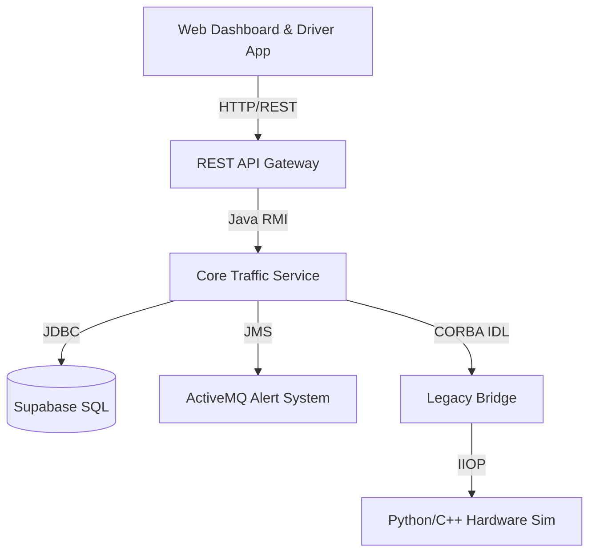

# 🚦 Distributed Real-Time Vehicle Tracking & Traffic Analysis System


> **TrafficPulse AI** is a next-generation distributed system designed to solve urban paralysis. It bridges the gap between legacy traffic infrastructure (C++) and modern AI analytics (Java) using a hybrid architecture of RMI, CORBA, and REST.

---

## 📑 Table of Contents

- [🔭 System Architecture](#-system-architecture)
- [✨ Key Features](#-key-features)
- [📂 Project Structure](#-project-structure)
- [⚙️ Prerequisites](#-prerequisites)
- [🚀 The Boot Protocol (Start Here)](#-the-boot-protocol-crucial)
- [📡 API Documentation](#-api-documentation)
- [🔧 Troubleshooting](#-troubleshooting)
- [👨‍💻 Authors](#-authors)

---

## 🔭 System Architecture

This project implements a multi-layered distributed architecture:



<br>

1.  **Client Layer:** HTML5/JS Dashboards for visualization.
2.  **Gateway Layer:** A Multi-threaded HTTP Server translating REST to RMI.
3.  **Application Layer:** Java RMI Server handling business logic, routing (Dijkstra), and alerts.
4.  **Hardware Layer:** Python-based CORBA server simulating physical traffic lights.

---

## ✨ Key Features

*   **🌐 Universal Interoperability:** Controls legacy hardware via CORBA while serving modern web clients via REST.
*   **🛣️ Smart Routing:** Custom Dijkstra algorithm implementation for optimal pathfinding between cities.
*   **⚡ Real-Time Telemetry:** High-frequency GPS ingestion and speed analysis.
*   **🚨 Automated Policing:** Instant detection of speeding violations triggers JMS alerts to the "Police Station" module.
*   **🌉 Hybrid Tech Stack:** Seamless integration of Java, Python, and SQL.

---

## 📂 Project Structure

```bash
TrafficControlSystem/
├── src/
│   ├── com/traffic/
│   │   ├── client/         # Driver Simulators & Test Clients
│   │   ├── common/         # RMI Interfaces & Data Models
│   │   ├── core/           # RMI Server, Route Optimizer, & JMS Logic
│   │   ├── data/           # Supabase & JDBC Repositories
│   │   └── gateway/        # HTTP REST API Gateway
│   └── TrafficLegacy/      # Generated CORBA IDL Stubs
├── hardware_server.py      # Python CORBA Hardware Simulator
├── TrafficLight.idl        # IDL Definition for Hardware
├── dashboard.html          # Command Center UI
├── driver_app.html         # Driver Companion App
└── hardware.ior            # (Generated) CORBA Object Reference
```

---

## ⚙️ Prerequisites

Before running the system, ensure you have the following installed:

1.  **Java Development Kit (JDK):** Version 17 or higher.
2.  **Python:** Version 3.x (for hardware simulation).
3.  **Apache ActiveMQ:** (Optional) For the JMS Alerting system.
    *   *Download:* [ActiveMQ Website](https://activemq.apache.org/)
    *   *Start:* `./bin/activemq start`
4.  **Python Libraries:**
    ```bash
    pip install omniORB
    ```

---

## 🚀 The Boot Protocol (Crucial)

⚠️ **Strict Start-up Order Required!**
Because this system is distributed, components depend on each other. You **must** follow this order exactly. Open 4 separate terminal windows.

### Step 1: The Legacy Hardware (CORBA Server)
This simulates the physical traffic lights waiting for commands.
```bash
java -cp out/production/TrafficControlSystem com.traffic.core.bridge.CorbaHardwareServer
```
> **Check:** Wait for `>>> [PYTHON] 'hardware.ior' written.`

### Step 2: The Core Brain (RMI Server)
Initializes the logic, connects to the database, and finds the hardware.
```bash
# From project root
java -cp out/production/TrafficControlSystem com.traffic.core.server.RmiServer
```
> **Check:** Wait for `[BRIDGE] Connected to Legacy Hardware` and `>>> SERVER READY.`

### Step 3: The API Gateway (HTTP Bridge)
Opens the port 8080 for web browsers.
```bash
java -cp out/production/TrafficControlSystem com.traffic.gateway.RestApiGateway
```
> **Check:** Wait for `>>> [GATEWAY] HTTP REST API started on port 8080`

### Step 4: The Client Interfaces
Simply open the HTML files in your browser:
1.  **Dashboard:** Open `dashboard.html` (Monitor traffic).
2.  **Driver App:** Open `driver_app.html` (Simulate a car).

> **Verification:** On the Driver App, the status badge should turn **GREEN (ONLINE)**.

---

## 📡 API Documentation

The Gateway exposes the following REST endpoints on `localhost:8080`:

| Method | Endpoint | Description | Payload Example |
| :--- | :--- | :--- | :--- |
| `GET` | `/status` | System Health Check | N/A |
| `POST` | `/api/report` | Ingest Telemetry | `{"vehicleId": "CAB-1", "lat": 36.8, "lon": 10.1, "speed": 85}` |
| `GET` | `/api/dashboard` | Get All Vehicles | N/A |
| `GET` | `/api/route` | Calculate Path | `?from=Tunis&to=Sfax` |
| `POST` | `/api/control` | Toggle Traffic Light | `{"junctionId": "TUN-01", "command": "RED"}` |

---

## 🔧 Troubleshooting

*   **`Connection Refused` on RmiServer:**
    *   Is ActiveMQ running? If not, the server will log a warning but continue working (Alerts will be disabled).
*   **`CORBA COMM_FAILURE`:**
    *   Did you run Step 1 (Python) before Step 2 (Java)?
    *   Does `hardware.ior` exist in the root directory?
*   **Map not loading:**
    *   Ensure you have an active internet connection (Leaflet.js loads map tiles from OpenStreetMap).

---

## 👨‍💻 Authors

**Distributed Systems Engineering Team:**

*   **Mouhamed Gharsallah** - *Lead Architect & Backend*
*   **Imen BOUCHELLIGA** - *Operations & Hardware Integration*

---

<div align="center">
  <sub>Built for the Future of Smart Cities. © 2025 TrafficPulse Inc.</sub>
</div>
```
